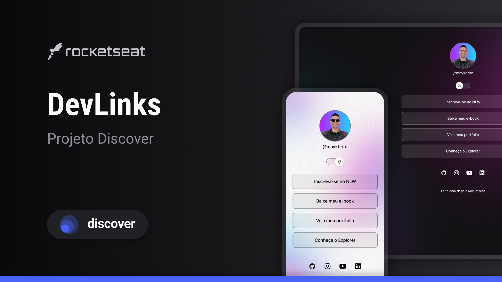

  
  

## 💻 Projeto

O DevLinks é um agregador de links para usar como um cartão de visitas online.

## ✨ Tecnologia

Esse projeto foi desenvolvido com as seguintes tecnologias:

- HTML e CSS
- JavaScript
- Git e GitHub
- Figma

## 🔖 Layout

Você pode visualizar o layout do projeto através do link abaixo:

- [Layout](https://www.figma.com/design/lKsMxgt6sfw3G3Wn7ADoQd/DevLinks-•-Projeto-Discover-(Community)?node-id=10-620&t=i2U9jE0VaGcK2Rig-0)

Lembrando que você precisa ter uma conta no [Figma](http://figma.com/).

## 📝 License

Esse projeto está sob a licença MIT. 

---

  Feito com 💜 by Rocketseat

  <a href="https://discord.gg/rocketseat">👉 Participe da nossa comunidade 👈</a>

<!--START_SECTION:footer-->

 
 

  

<!--END_SECTION:footer-->